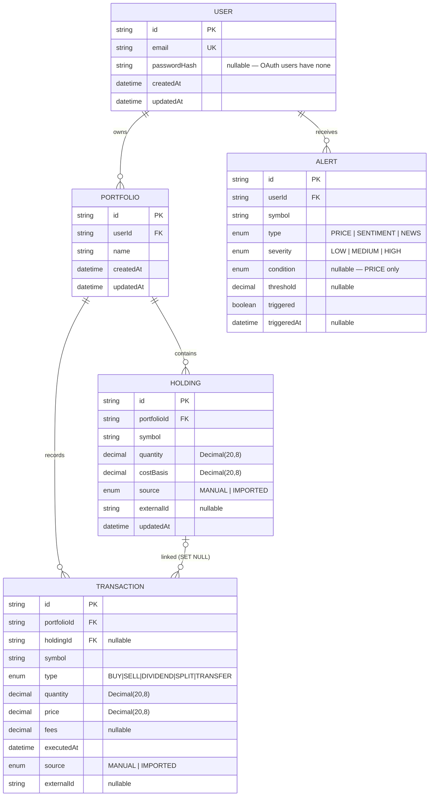

<div align="center">

# MarketMind

**An AI-powered market intelligence platform.**
Turn fragmented financial signals — news, prices, portfolios — into contextual, real-time understanding.

</div>

> _"Understand what moved your portfolio, why it moved, and what it means — all in one conversation."_

---

## What it does

MarketMind acts as an autonomous market analyst. Instead of forcing you to manually correlate
headlines with price action, it:

- Ingests global financial news and market data in real time
- Detects relationships between news events and asset price movements
- Tracks your portfolio and its evolving exposure
- Explains *why* markets move in natural language
- Surfaces risk-aware, context-driven alerts

It is **explainable and non-advisory by design** — every output is grounded, sourced, and carries
an explicit uncertainty level. No black-box finance advice.

---

## Architecture

A layered, service-oriented monorepo. The request path runs from the frontend through an API
gateway to domain services, which sit on top of an AI intelligence layer and a shared data store.

```
Frontend (Next.js)
      │
  API Gateway        ── auth · routing · rate limiting
      │
Domain Services      ── portfolio · market-data · news-intelligence
      │
AI Intelligence      ── RAG · event correlation · reasoning
      │
Data Ingestion       ── RSS · GDELT/NewsAPI · market data
      │
Storage              ── Postgres · Redis · Vector DB
```

See [`docs/architecture.md`](docs/architecture.md) for the full specification.

---

## Repository layout

| Path | What lives here | Lang |
|------|-----------------|------|
| `apps/web` | Next.js frontend — dashboard, chat, market, news, alerts | TS |
| `apps/api-gateway` | Auth (JWT/OAuth), routing, rate limiting, caching | TS |
| `services/portfolio` | Holdings, PnL, allocation, risk scoring | TS |
| `services/market-data` | Ingest, normalize stocks + crypto, OHLC | TS |
| `services/news-intelligence` | Entity extraction, sentiment, impact, clustering | Python |
| `services/ai-orchestration` | RAG, correlation, reasoning, response generation | Python |
| `services/ingestion` | News sources, normalization, event scoring | Python |
| `packages/types` | Shared TypeScript types | TS |
| `packages/db` | Prisma schema + migrations | TS |
| `packages/events` | The "market event" contract + queue helpers | TS |
| `packages/config` | Shared tsconfig / eslint / env validation | TS |
| `infra/` | Dockerfiles, k8s manifests, DB bootstrap | — |
| `docs/` | Architecture, algorithms, API contracts | — |

---

## Data model

The core schema lives in [`packages/db/prisma/schema.prisma`](packages/db/prisma/schema.prisma)
(the source of truth). Postgres holds **user, portfolio, and transactional state only** — market
events live in `packages/events` and embeddings in the vector DB.



Notes on the model:

- **Money and quantities are `Decimal(20,8)`, never floats** — float rounding on financial data is a
  silent, compounding bug.
- **`Holding` is one aggregated position per symbol per portfolio** (`@@unique([portfolioId, symbol])`);
  lot-level history lives in `Transaction` rows.
- **Transactions are an immutable ledger.** Deleting a portfolio cascades to its holdings and
  transactions, but deleting a holding only nulls the `Transaction.holdingId` link — the audit trail
  survives. `holdingId` is nullable because dividends and transfers may not map to a holding.
- **`Alert` is a single-table discriminated union.** `type` is the discriminator; `condition` and
  `threshold` apply only to `PRICE` alerts. The per-type required-field invariant is enforced in the
  alert service, not the database.
- **`source` + `externalId`** on `Holding`/`Transaction` are the seam for V2 brokerage import; all
  MVP records are `MANUAL`. We never store brokerage credentials — that goes through an aggregator.

---

## Getting started

### Prerequisites
- Node.js 18+ and **pnpm**
- **uv** (for the Python services)
- Docker (for Postgres, Redis, and the vector DB)

### Setup
```bash
git clone <repo-url> marketmind && cd marketmind

pnpm install                  # install JS/TS workspaces
docker compose up -d          # start Postgres + Redis + vector DB
cp .env.example .env          # then fill in API keys and secrets
pnpm db:migrate               # apply database migrations
```

### Run
```bash
pnpm dev                      # run all apps + services
pnpm dev --filter web         # run a single workspace

# Python services
cd services/ai-orchestration && uv sync && uv run dev
```

### Test & lint
```bash
pnpm test
pnpm lint && pnpm typecheck
```

---

## Roadmap

| Phase | Scope |
|-------|-------|
| **MVP** | Stock search · news ingestion · chat Q&A · basic portfolio tracking |
| **V1** | Sentiment engine · alerts · charts integration |
| **V2** | Correlation engine · personalization · real-time streaming · brokerage import |
| **V3** | Multi-asset reasoning · predictive insights *(careful framing)* |

---

## Developing with Claude Code

This repo includes a [`CLAUDE.md`](CLAUDE.md) at the root that gives Claude Code persistent context
about the architecture, service boundaries, and conventions — it's read automatically at the start
of every session. When working on a specific area, run Claude Code from that workspace and keep
changes scoped to it; flag anything that crosses a service boundary or touches a shared contract
in `packages/`.

---

## License

_TBD._